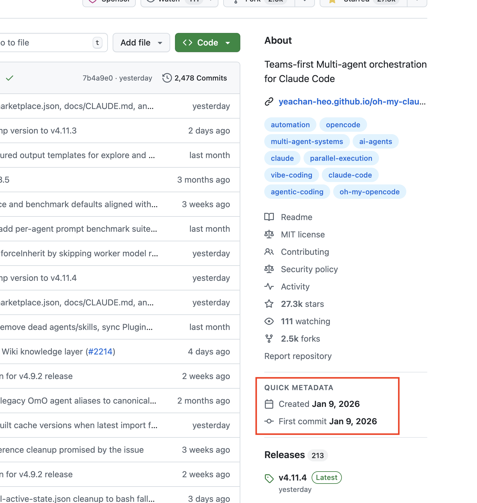
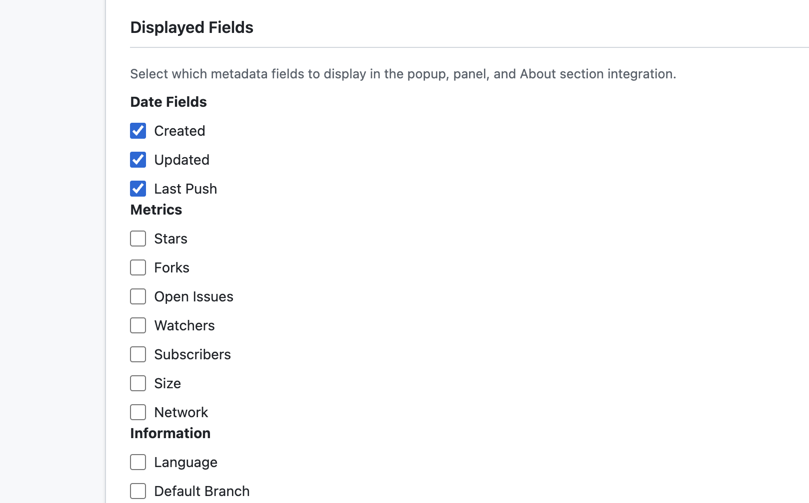

# GitHub Quick Metadata

Display GitHub repository metadata directly in the About section. View creation date, update time, and 25+ customizable fields - all without leaving the page.

## Features

- **Configurable Fields**: Choose from 25+ metadata fields across 4 categories (dates, metrics, info, flags)
- **Default Display**: Shows repository creation date and last update time by default
- **About Section Integration**: Metadata appears natively in GitHub's About sidebar
- **Popup & Panel Views**: Quick popup or full side panel for detailed information
- **Smart Caching**: Local caching with automatic expiration to minimize API calls
- **SPA Navigation Support**: Works seamlessly with GitHub's Turbo framework
- **Multiple Installation Methods**: Available as Chrome/Firefox extension or userscript

### Optional: GitHub Personal Access Token

**Only needed for heavy usage.** Without a token, you get 60 API requests/hour which is sufficient for normal browsing. Providing a token increases this to 5,000 requests/hour. See [Configuration](#configuration) below.

## Screenshots

### Metadata Display on GitHub Repository


*Repository metadata displayed directly in GitHub's native About section*

### Settings Page - Field Configuration


*Configure which metadata fields to display - choose from 25+ fields across 4 categories*

> **Note**: To create these screenshots:
> 1. Load the extension: `npm run build && load dist/chrome in chrome://extensions`
> 2. Visit any GitHub repo (e.g., https://github.com/facebook/react)
> 3. Screenshot 1: Capture the About section showing the metadata
> 4. Screenshot 2: Click extension icon → Settings, capture the "Displayed Fields" section

## Installation

### Chrome Web Store (Recommended)

[Install from Chrome Web Store](#) _(Coming soon)_

### Firefox Add-ons

[Install from Firefox Add-ons](#) _(Coming soon)_

### Userscript (Greasyfork)

[Install from Greasyfork](#) _(Coming soon)_

Requires a userscript manager like:
- [Tampermonkey](https://www.tampermonkey.net/) (Chrome, Firefox, Safari, Edge)
- [Violentmonkey](https://violentmonkey.github.io/) (Chrome, Firefox, Edge)
- [Greasemonkey](https://www.greasespot.net/) (Firefox)

### Manual Installation from Source

#### Chrome/Edge

1. Clone this repository:
   ```bash
   git clone https://github.com/your-username/github-quick-metadata.git
   cd github-quick-metadata
   ```

2. Install dependencies and build:
   ```bash
   npm install
   npm run build:chrome
   ```

3. Open Chrome/Edge and navigate to `chrome://extensions/`

4. Enable "Developer mode" (toggle in top right)

5. Click "Load unpacked" and select the `dist/chrome` directory

#### Firefox

1. Clone and build:
   ```bash
   git clone https://github.com/your-username/github-quick-metadata.git
   cd github-quick-metadata
   npm install
   npm run build:firefox
   ```

2. Open Firefox and navigate to `about:debugging#/runtime/this-firefox`

3. Click "Load Temporary Add-on"

4. Navigate to `dist/firefox` and select `manifest.json`

#### Userscript

1. Clone and build:
   ```bash
   git clone https://github.com/your-username/github-quick-metadata.git
   cd github-quick-metadata
   npm install
   npm run build:userscript
   ```

2. Install a userscript manager (Tampermonkey/Violentmonkey/Greasemonkey)

3. Open `dist/userscript/github-quick-metadata.user.js` in your text editor

4. Copy the entire contents

5. Create a new userscript in your userscript manager and paste the code

## Usage

1. **Navigate to any GitHub repository** (e.g., https://github.com/facebook/react)

2. **View metadata** - Automatically displayed in GitHub's About section sidebar:
   - **Default**: Creation date and last update time
   - **Customizable**: Configure which fields to show in Settings

3. **Extension users**:
   - Click the extension icon for a quick popup view
   - Click "Open in Panel" for a full side panel view
   - Access Settings to customize displayed fields

4. **Userscript users**: A "Repo Metadata" toggle button will appear on the page

5. **Navigate between repositories**: Metadata automatically updates when you navigate to different repos

## Configuration

### Displayed Fields

Customize which metadata fields to show:

1. Click the extension icon → Settings (gear icon)
2. Scroll to "Displayed Fields" section
3. Choose from 25+ fields in 4 categories:
   - **Date Fields**: Created, Updated, Last Push
   - **Metrics**: Stars, Forks, Size, Open Issues, Watchers, etc.
   - **Information**: Language, License, Description, Homepage
   - **Flags**: Archived, Fork, Has Issues, Has Wiki, etc.

### GitHub Personal Access Token (Optional)

**Only needed for heavy usage.** GitHub allows 60 API requests/hour without authentication, which is sufficient for normal browsing. A Personal Access Token increases this to 5,000 requests/hour.

**To set up a token (if needed):**

1. **Generate a token**:
   - Go to [GitHub Settings → Personal access tokens](https://github.com/settings/tokens)
   - Click "Generate new token (classic)"
   - Give it a name (e.g., "GitHub Quick Metadata")
   - **No permissions needed** - leave all checkboxes unchecked (public read-only)
   - Click "Generate token" and copy it immediately

2. **Add to extension**:
   - Click extension icon → Settings
   - Scroll to "GitHub Personal Access Token (Optional)"
   - Paste token and it will be saved locally

**Note**: Your token is stored locally on your device and only used to authenticate with GitHub's API.

## Development

### Prerequisites

- Node.js 16+ and npm
- Modern web browser (Chrome/Firefox)

### Setup

```bash
# Clone the repository
git clone https://github.com/your-username/github-quick-metadata.git
cd github-quick-metadata

# Install dependencies
npm install
```

### Build Commands

```bash
# Build all targets (Chrome, Firefox, Userscript)
npm run build

# Build specific target
npm run build:chrome      # Chrome extension → dist/chrome/
npm run build:firefox     # Firefox extension → dist/firefox/
npm run build:userscript  # Userscript → dist/userscript/

# Development mode (watch for changes)
npm run dev

# Lint code
npm run lint
```

### Project Structure

```
github-quick-metadata/
├── src/
│   ├── core/              # Core business logic
│   │   ├── api.js         # GitHub API client
│   │   ├── cache.js       # localStorage caching layer
│   │   ├── parser.js      # URL parsing and repo detection
│   │   ├── stats.js       # Commit statistics calculation
│   │   └── navigation.js  # SPA navigation handling
│   ├── ui/                # User interface components
│   │   ├── panel.js       # Side panel component
│   │   ├── popup.js       # Extension popup
│   │   └── settings.js    # Settings page
│   ├── utils/             # Utility functions
│   │   ├── date.js        # Date formatting
│   │   ├── dom.js         # DOM manipulation helpers
│   │   └── github.js      # GitHub page detection
│   ├── extension.js       # Extension entry point
│   ├── userscript.js      # Userscript entry point
│   ├── main-extension.js  # Extension bundler entry
│   └── main-userscript.js # Userscript bundler entry
├── dist/                  # Build output (generated)
│   ├── chrome/           # Chrome extension
│   ├── firefox/          # Firefox extension
│   └── userscript/       # Userscript
├── rollup.config.js      # Build configuration
├── package.json
├── LICENSE
├── README.md
├── CHANGELOG.md
└── CONTRIBUTING.md
```

## Contributing

Contributions are welcome! Please read [CONTRIBUTING.md](CONTRIBUTING.md) for guidelines on how to:

- Report bugs
- Suggest features
- Submit pull requests
- Follow code style guidelines

## License

MIT License - see [LICENSE](LICENSE) file for details.

## Acknowledgments

- Built with [Rollup](https://rollupjs.org/) for bundling
- Uses GitHub's [REST API v3](https://docs.github.com/en/rest)
- Inspired by the need for quick repository insights without leaving GitHub

## Support

- **Issues**: [GitHub Issues](https://github.com/your-username/github-quick-metadata/issues)
- **Discussions**: [GitHub Discussions](https://github.com/your-username/github-quick-metadata/discussions)

---

**Open Source** | **Privacy-First** | **No Data Collection**
